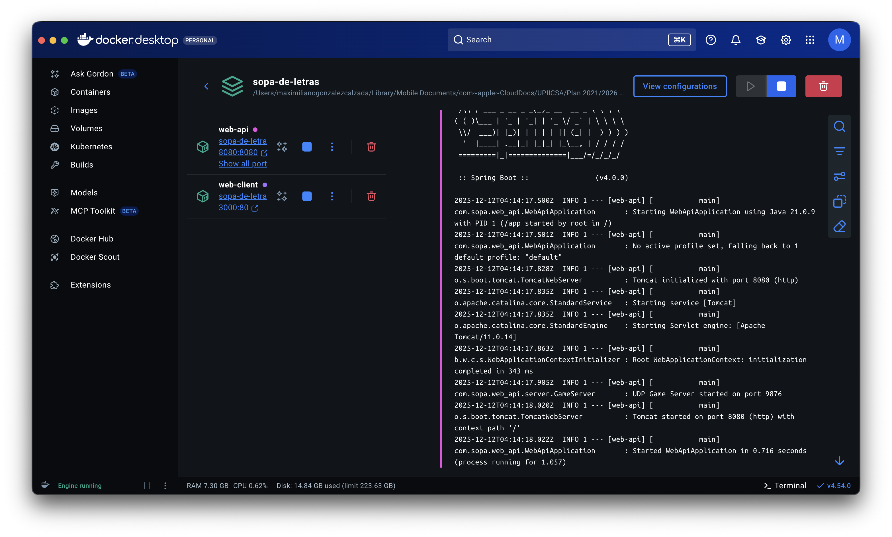
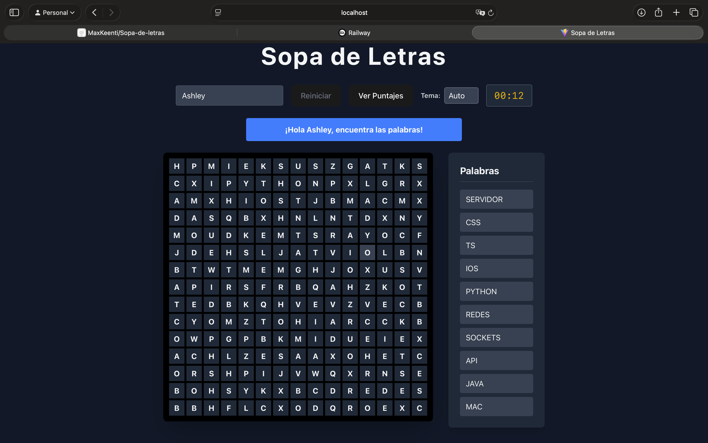
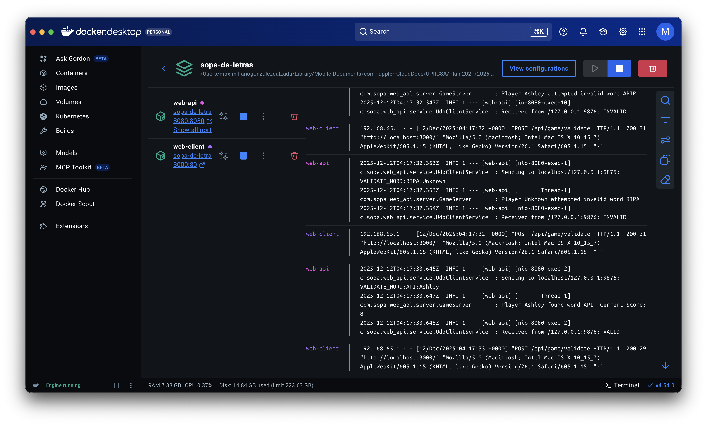
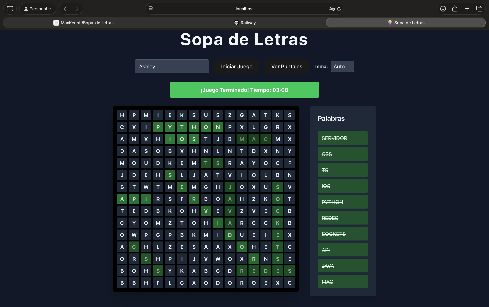
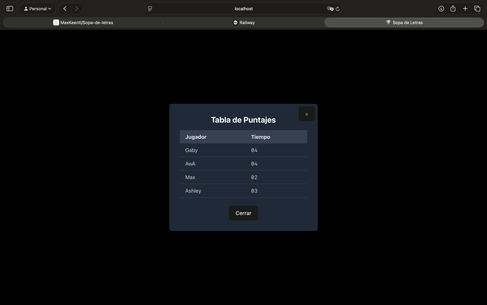

# Sopa de Letras con Sockets UDP

**Unidad de Aprendizaje:** Redes y Conectividad  
**Equipo:** 3  
**Grupo:** 5NM52  
**Profesor:** Hernández Cerón Ricardo  
**Fecha de Entrega:** 11 de diciembre de 2025

**Integrantes:**
- Garcia Salgado Angel Gabriel
- García Zavala Sebastián
- Garrido Cázares Ashley Elizabeth
- Gonzalez Calzada Maximiliano
- Espinosa Esquivias Mauricio Genaro

---

## Objetivo
Implementar un sistema distribuido para el juego "Sopa de Letras", aplicando los fundamentos de la programación en red. El objetivo principal es establecer una comunicación efectiva mediante **Sockets de Datagrama (UDP)** y gestionar la concurrencia a través de **Hilos (Threads)**, cumpliendo con los requisitos de identificación de usuarios, validación lógica y persistencia de datos.

## Competencia Específica
Desarrollar aplicaciones en red robustas bajo el modelo cliente-servidor, integrando mecanismos de comunicación no orientados a conexión (UDP) y procesamiento concurrente para la atención múltiple de clientes.

## Desarrollo
El proyecto materializa una arquitectura moderna y desacoplada, dividida en contenedores Docker para garantizar la portabilidad y escalabilidad.

### Arquitectura del Sistema
El sistema opera bajo un esquema híbrido que combina la robustez de Java con la interactividad de React:

- **Cliente Web (Frontend)**: Desarrollado en **React** con **Vite** y estilizado mediante **Tailwind CSS**. Es responsable de la presentación, la captura de eventos del usuario (selección de celdas) y la gestión del estado visual (temas claro/oscuro).
- **Web API Gateway (Backend)**: Implementado en **Spring Boot**. Expone endpoints REST (`/start`, `/validate`, `/scores`) que actúan como una fachada. Internamente, este componente traduce las peticiones HTTP en paquetes UDP.
- **Servidor de Juego (UDP/Logic)**: Un componente crítico escrito en Java puro que extiende la clase `Thread`. Escucha en el puerto `9876` y procesa comandos (`START`, `VALIDATE`, `END`) de forma asíncrona.

### Características Técnicas Implementadas

#### Comunicación por Sockets UDP
La comunicación interna no utiliza TCP, sino `DatagramSocket`, lo que permite un intercambio de mensajes ligero ("Fire and forget").
- **Protocolo Definido**: Se diseñó un protocolo de texto simple: `COMANDO:DATOS:JUGADOR`.
- **Ejemplo**: `VALIDATE_WORD:JAVA:Max` envía la palabra "JAVA" intentada por el jugador "Max".

#### Concurrencia y Manejo de Sesiones
El servidor mantiene un `Map<String, List<String>>` para gestionar el estado de cada jugador de forma aislada.
- **Aleatoriedad por Hilo**: Cada vez que un jugador inicia, se seleccionan 10 palabras únicas de un diccionario maestro (que incluye términos como `DOCKER`, `ANGULAR`, `PYTHON`), asegurando que cada partida sea única.
- **Validación Contextual**: El servidor valida la palabra contra la lista específica de *ese* jugador, previniendo condiciones de carrera o validaciones cruzadas incorrectas.

#### Persistencia de Datos y Docker Volumes
Uno de los retos principales fue la persistencia en un entorno efímero como Docker.
- Se implementó la escritura en un archivo plano `scores.txt` (`FileWriter` en modo append).
- **Solución de Infraestructura**: Se configuró un *volumen* en `docker-compose.yml` (`./scores.txt:/scores.txt`) para mapear el archivo del contenedor al sistema de archivos del anfitrión (Host), garantizando que los puntajes históricos ("Leaderboard") sobrevivan al reinicio de los contenedores.

#### Interfaz de Usuario (UI/UX)
Se priorizó la experiencia de usuario con:
- **Tema Dinámico**: Soporte para modo oscuro/claro automático basado en preferencias del sistema.
- **Feedback Visual**: Retroalimentación inmediata (colores verde/rojo) al validar palabras.
- **Leaderboard**: Una ventana modal que consume el endpoint `/scores` para mostrar los tiempos históricos.

## Pruebas y Resultados
El despliegue se realiza mediante `docker compose up --build`.

**Pruebas de Integración:**
1. **Inicio**: El cliente envía el nombre, el servidor reserva las 10 palabras y retorna la matriz.
2. **Juego**: El usuario selecciona "JAVA". El cliente envía la petición, el servidor confirma y actualiza el puntaje en memoria.
3. **Finalización**: Al encontrar las 10 palabras, el cliente envía el tiempo total. El servidor escribe en `scores.txt` de manera sincronizada (`synchronized`) para evitar corrupción por escritura concurrente.

### Galería de Funcionamiento

| Inicio / Juego | Validación |
| --- | --- |
|  |  |
|  |  |

## Conclusiones
Como equipo, este proyecto nos permitió consolidar conocimientos clave en sistemas distribuidos. Aprendimos que:
- **UDP vs TCP**: Aunque UDP no garantiza entrega, su simplicidad es ideal para mensajes cortos y rápidos dentro de una red controlada (como la red interna de Docker).
- **Gestión de Estado**: Mantener el estado del juego en el servidor (palabras por jugador) es crucial para la seguridad y consistencia lógica.
- **Dockerización**: La contenedorización no es solo "empaquetar", sino entender cómo interactúa el sistema de archivos del contenedor con el mundo exterior (Volumes), un punto donde inicialmente tuvimos dificultades pero logramos resolver eficazmente.
- **Full Stack**: La integración de un Frontend reactivo con un Backend robusto en Java demuestra la versatilidad necesaria en el desarrollo de software moderno.

El resultado final es una aplicación resiliente, estéticamente agradable y funcionalmente completa que cumple con todos los requerimientos académicos planteados.
